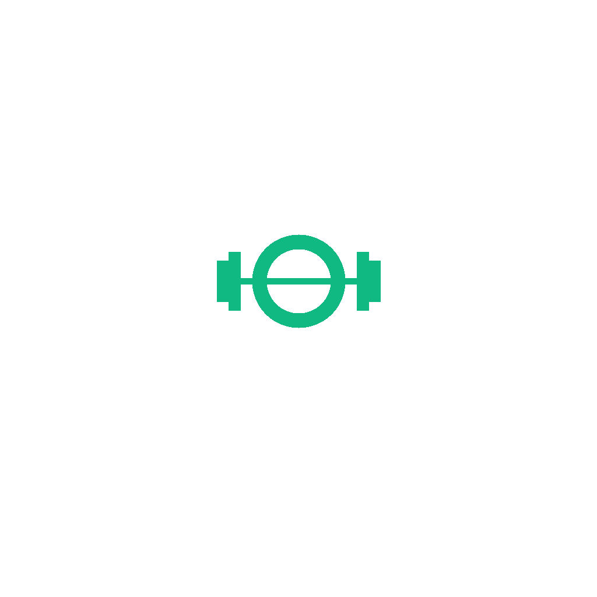

<div align="center">
  
  <h1>BodyBuilder App</h1>
  <p>
    <strong>A Premium, Cross-Platform Fitness & Coaching Ecosystem</strong>
  </p>

  <p>
    <a href="https://reactnative.dev/"></a>
    <a href="https://expo.dev/"></a>
    <a href="https://www.typescriptlang.org/"></a>
  </p>
</div>

<br />

## 📖 Overview

**BodyBuilder** is a modern, high-performance fitness application built with React Native and Expo Router. It aims to bridge the gap between fitness enthusiasts, professional coaches, and physical gyms by providing a unified platform for workout tracking, community engagement, and AI-assisted coaching.

Designed with a sleek, dark-themed UI and green accents, the application focuses on user retention through a premium UX/UI and comprehensive toolsets.

---

## ✨ Key Features

### 🏠 Home & Dashboard (Phase 1)
- **Dynamic Quick Actions**: One-tap access to Workouts, Nutrition, AI Assistant, and Video Calls.
- **Story Highlights**: Instagram-style horizontal stories for quick coach updates and user milestones.
- **Community Feed**: A rich feed displaying user achievements, workout photos, and social engagement.

### 👥 Profile & Social (Phase 2)
- **Profile Hub**: Track total workouts, week streaks, and follower counts.
- **Gallery Grid**: A beautiful masonry/grid view of user progress photos and past achievements.
- **Post Creation**: Seamless media upload UI to share progress with the community.

### 💪 Workout Tracking (Phase 3)
- **Weekly Calendar**: Interactive top-level calendar to switch between workout days.
- **Routine Breakdown**: Detailed list of daily exercises, including set and rep tracking.
- **Live Execution**: Intuitive "Start Workout" flow with duration and location context.

### 📍 Gym Locator (Phase 4)
- **Smart Search**: Find gyms by name or location.
- **Filtering**: Sort by "Nearby", "Popular", and "Price".
- **Live Status**: Displays ratings, distances, and real-time "Open Now" / "Closed" statuses.

### 💬 Unified Communications (Phase 5)
- **Chat Hub**: Filter conversations by All, Coaches, Clients, and Groups.
- **Visual Cues**: Verified badges for professional coaches and specialized avatars for the AI Assistant.
- **Read Receipts**: Real-time unread badges and delivery statuses.

---

## 🛠 Tech Stack & Architecture

- **Framework**: [React Native](https://reactnative.dev/) powered by [Expo SDK 53](https://expo.dev/).
- **Routing**: [Expo Router](https://docs.expo.dev/router/introduction/) for intuitive, file-based navigation (Stack & Tabs).
- **Language**: [TypeScript](https://www.typescriptlang.org/) for robust, type-safe development.
- **Styling**: Standard React Native StyleSheet layered with a centralized scalable color design system (`constants/colors.ts`).
- **Icons**: `@expo/vector-icons` utilizing the modern `Ionicons` set.

---

## 📁 Directory Structure

```text
bodybuilder-app/
├── app/                      # Expo Router File-Based Routing
│   ├── (tabs)/               # Bottom Tab Navigator
│   │   ├── _layout.tsx       # Tab bar configuration & styling
│   │   ├── index.tsx         # Home Screen (Phase 1)
│   │   ├── community.tsx     # Community Feed (Phase 2)
│   │   ├── create.tsx        # Create Post Screen (Phase 2)
│   │   ├── chat.tsx          # Unified Chat Interface (Phase 5)
│   │   └── profile.tsx       # User Profile (Phase 2)
│   ├── gym/                  # Stack: Find a Gym (Phase 4)
│   ├── workout/              # Stack: Workout Tracker (Phase 3)
│   └── _layout.tsx           # Global Root Layout
├── components/               # Reusable UI Components
│   ├── home/                 # Home-specific parts (HeroBanner, QuickActions, etc.)
│   └── layout/               # Global layout wrappers (Header, etc.)
├── constants/                # Global Settings & Mock Data
│   ├── colors.ts             # Theme color palette
│   └── mockData.ts           # JSON structures for UI scaffolding
├── assets/                   # Static media (Splash, Icons)
└── package.json              # Project dependencies and scripts
```

---

## 🚀 Getting Started

### Prerequisites
- [Node.js](https://nodejs.org/) (v18+ recommended)
- [Expo Go](https://expo.dev/client) app installed on your iOS/Android device.

### Installation

1. **Clone the repository:**
   ```bash
   git clone https://github.com/yourusername/bodybuilder-app.git
   cd bodybuilder-app
   ```

2. **Install dependencies:**
   ```bash
   npm install
   ```

3. **Start the development server:**
   ```bash
   npx expo start
   ```

4. **Run on Device:**
   - Open the **Expo Go** app on your physical device.
   - Scan the QR code displayed in your terminal.

---

## 📦 Build & Deployment

This project is configured to be built via **Expo Application Services (EAS)** for seamless deployment to the Apple App Store and Google Play Store.

```bash
# Install EAS CLI globally
npm install -g eas-cli

# Login to your Expo account
eas login

# Build the application for iOS and Android
eas build --platform all
```

---

## 📄 License

This project is licensed under the MIT License - see the LICENSE file for details.

---
<div align="center">
  <i>Engineered with excellence for the fitness community.</i>
</div>
